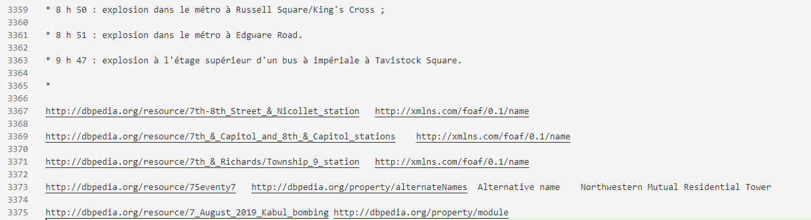

# Additional Information

## Duplicates and Incomplete triples

|   Data Sources   | Number of raw data | Number of incomplete data | Number of duplicates | Number of final data |
| :--------------: | :----------------: | :-----------------------: | :------------------: | :------------------: |
|  DBpedia-online  |     20,974,071     |          185,185          |      3,720,087       |      17,068,799      |
| DBpedia-snapshot |    132,565,791     |          666,742          |      1,950,634       |     130,948,415      |

DBpedia-online's exception data can be seen in the file [DBpedia_online_errorLines.csv](./DBpedia_online_errorLines.csv)

DBpedia-snapshot's exception data can be seen in the file [DBpedia-snapshot_errorLines.zip](./DBpedia-snapshot_errorLines.zip)

Incomplete Data Example

---

## Attribute Triples Data

Considering that attributes have been used to enrich the embedding of entities and relations in existing research, we provide the extracted attribute triples as an additional file of the dataset to facilitate subsequent related research.

Attribute triples data can be seen in the file [Attribute.tar.gz](https://zenodo.org/record/7431613/files/Attribute.tar.gz)

## S-DBpedia relations

S-DBpedia relations can be viewed in the file  [S-DBpedia_relationships.csv](./S-DBpedia_relationships.csv)

## Removed relations

During the evaluation process, we removed relations that were less associated with spatial information. These relations can be viewed in the file  [Removed_relations.csv](./Removed_relations.csv).

We also removed the triples in the dataset where the relation occurs less than 5 times.

